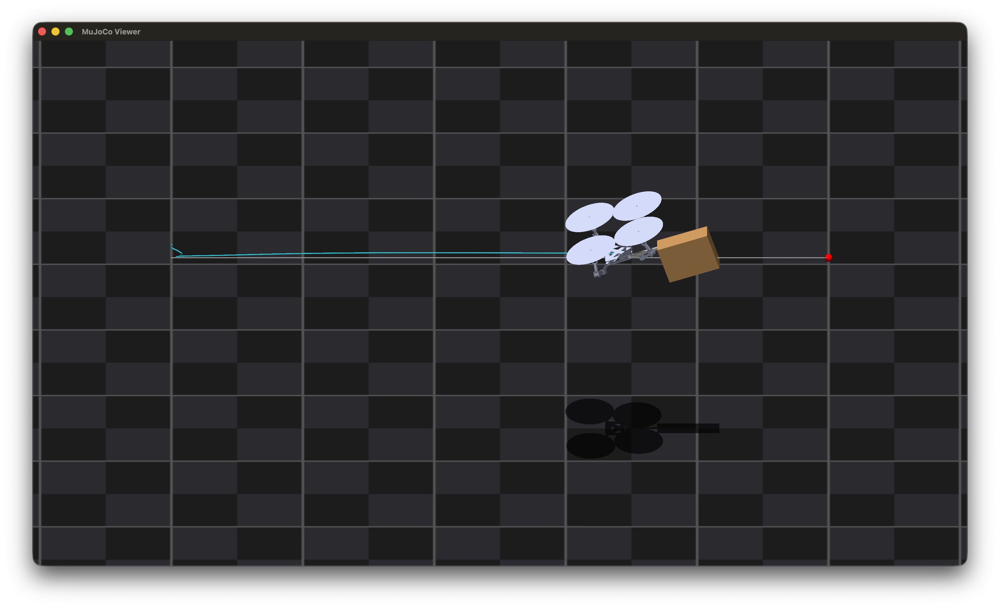
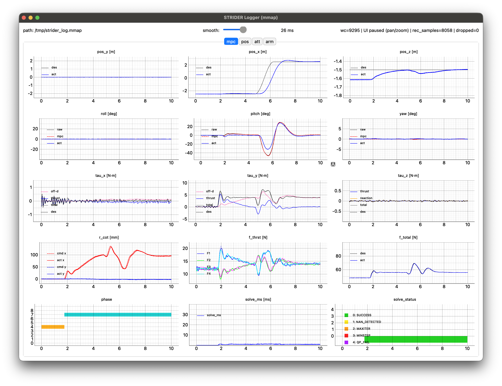

# STRIDER

- Trajectory-following simulation of the STRIDER model.(in MuJoCo)


- Real-time viewer&logger.


---

### Features

- NMPC Arm morphing:
- Flight Control: Geometric(SE(3)) Controller [[reference]](https://fdcl-gwu.github.io/uav_geometric_control/)
- [Acados](https://docs.acados.org)
- [Sequential control allocation](https://ieeexplore.ieee.org/document/11016760)

---

### Dependencies
- C++ : MuJoCo / Eigen3 / GLFW3 / OpenGL
- Python3 : acados_template / pybind11 / pyqt / vispy
- Tested: MacOS, Linux

---

### Build (CMake)

```bash
# (in root dir)
mkdir -p bild && cd build
cmake ..
make
```

---

### execution
- Run MuJoCo simulation
```bash
cd build
./strider
```
- Run real time flight Viewer 
```bash
cd apps/
# recording & realtime-view
python3 strider_logger.py
# replay recorded file
python3 strider_logger.py ~/apps/log/npz/your_log_file.npz
```
- Run real time NMPC stage state&input viewer.
```bash
cd resources/mpc_py
python3 mpc_viewer.py
```