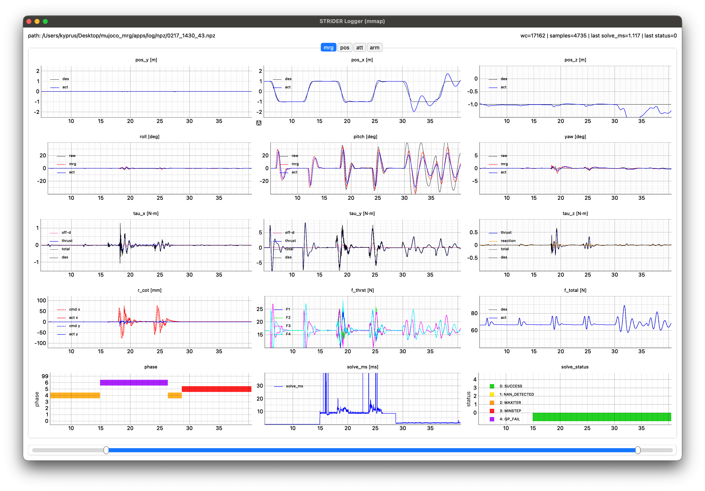
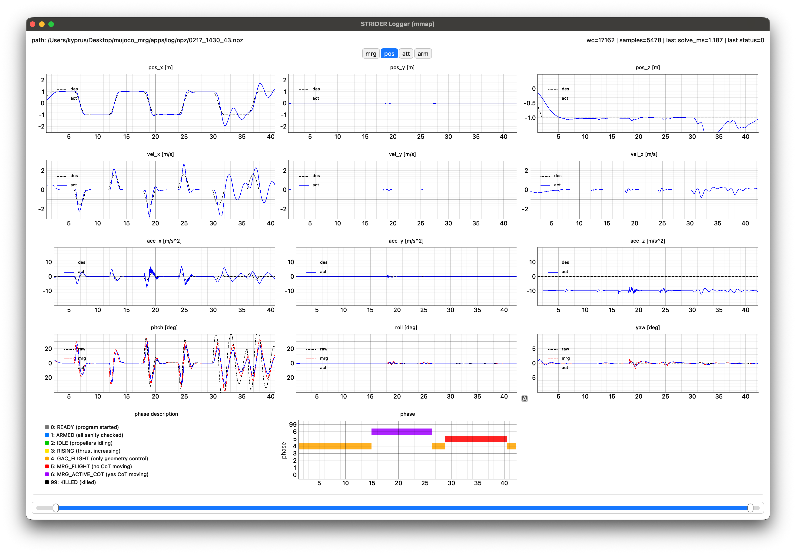
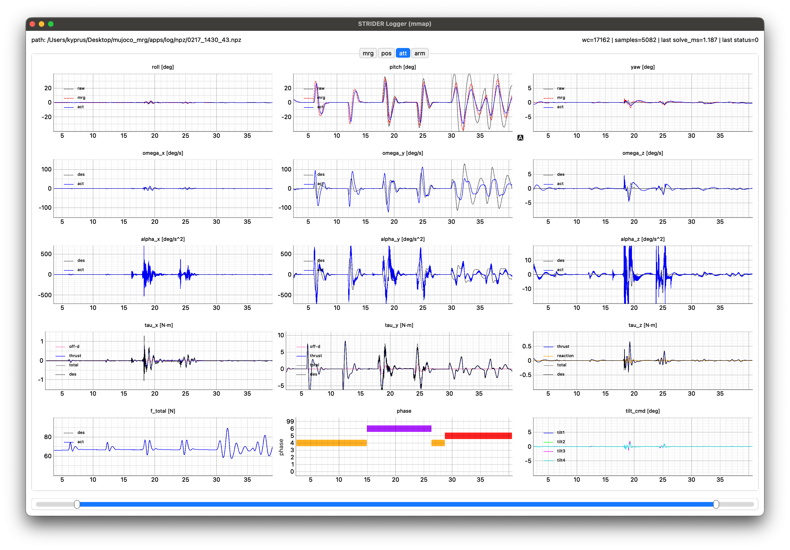
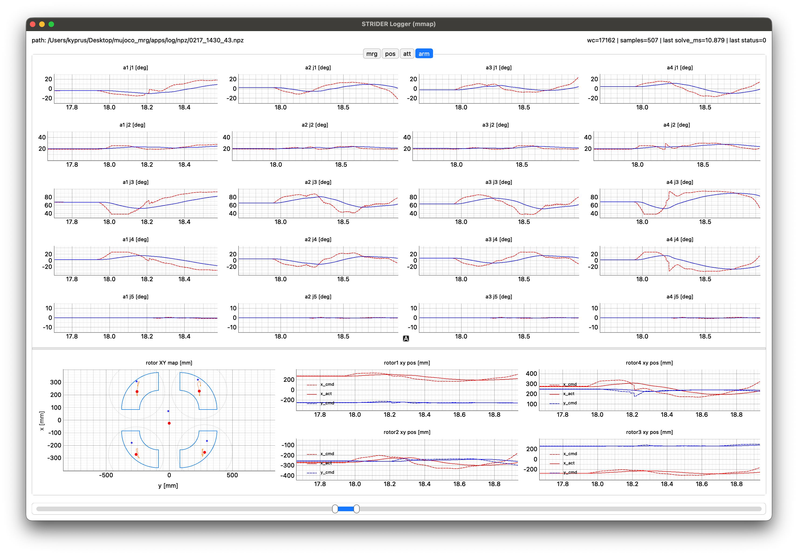
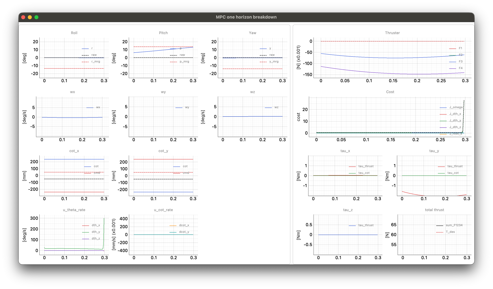

# STRIDER

- Trajectory-following simulation of the STRIDER model.(in MuJoCo)


- Real-time viewer&logger.
<p align="center">
  
  
</p>
<p align="center">
  
  
</p>

- MPC Reference Governor(MRG) real-time view.
<p align="center">
  
</p>

---

### Features

- Flight Control: Geometric(SE(3)) Controller [[paper]](https://arxiv.org/pdf/1003.2005), [[reference]](https://fdcl-gwu.github.io/uav_geometric_control/)
- Control allocation: Sequential control allocation [[paper]](https://ieeexplore.ieee.org/document/11016760)
- Arm morphing: Acados NMPC software package [[github]](https://docs.acados.org)

---

### Dependencies
- C++ : MuJoCo / Eigen3 / GLFW3 / OpenGL
- Python3 : acados_template / pybind11 / pyqt / vispy
- Tested: MacOS, Linux

### Build (CMake)

```bash
# (in root dir)
mkdir -p bild && cd build
cmake ..
make
```

### execution

```bash
cd build
./strider
```
- Can toggle MPC on/off by pressing space bar.
```bash
cd apps/
# recording & realtime-view
python3 strider_logger.py
# replay recorded file
python3 strider_logger.py ~/apps/log/npz/0217_1430_38.npz
python3 strider_logger.py ~/apps/log/mmap/0217_1430_38.mmap
```
- Real-time flight logger 

```bash
cd resources/mpc_py
python3 mpc_viewer.py
```
- Real-time MRG cost viewer.